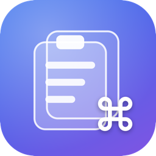

<div align="center">



# CmdV

**A free, open-source clipboard manager for macOS — with the native Liquid Glass look.**

[](https://github.com/TonmoyBishwas/CmdV/actions/workflows/ci.yml)
[](LICENSE)
[](#requirements)
[](#requirements)

</div>

CmdV remembers everything you copy — text, links, images, files, colors, code — and lets you find it and paste it again in seconds. Press **⇧⌘V** anywhere and a glass shelf slides up from the bottom of your screen with your entire clipboard history.

It's a lightweight, privacy-respecting, completely free alternative to paid clipboard managers like Paste. No subscription, no account, no cloud, no analytics. Everything stays on your Mac.

## Features

### 📋 Unlimited clipboard history
Everything you copy is captured automatically and classified by type — plain and rich text, links, images, files, colors, and code — each with its own card preview, source-app icon, and timestamp.

### 🔍 Instant search & filters
Open the shelf and just start typing. Search covers item text, titles, file names, source apps — and even **text inside screenshots**, thanks to fully on-device OCR (Apple Vision). Filter by content type with one click.

### 📚 Paste Stack
Press **⇧⌘C** to start a stack, copy a bunch of things from anywhere, then press **⌘V** repeatedly to paste them back **in order** — perfect for filling forms or assembling a document from many sources. Reverse the order or drop entries anytime.

### 📌 Pinboards
Keep templates, snippets, and links forever, organized into named, colored pinboards (⇧⌘N). Pinned items never expire, no matter your history settings.

### ⌨️ Keyboard-first
| Shortcut | Action |
|---|---|
| ⇧⌘V | Open / close the shelf (customizable) |
| ← → | Browse items |
| Return | Paste at cursor |
| ⇧Return | Paste as plain text |
| ⌘1 – ⌘9 | Quick-paste a visible card |
| Space | Quick Look preview |
| ⌘F <em>or just type</em> | Search |
| ⌘R / ⌘E | Rename / edit an item |
| ⌘N / ⇧⌘N | New text item / new pinboard |
| ⇧⌘C | Start / stop the Paste Stack |
| ⌘T | Pause / resume capturing (menu bar) |
| Delete | Remove item |

Plus: double-click to paste, drag cards out into any app, ⌘/⇧-click multi-select, right-click context menus.

### 🖱️ Quick copy from the menu bar
Click the clipboard icon in the menu bar for an instant list of your **pinned + most recent items** — one click copies. How many of each are shown is configurable in Settings. Hold the click (or right-click) for the options menu.

### 🔒 Privacy by design
- Copies from password managers are **never recorded** (CmdV honors the [concealed/transient pasteboard conventions](http://nspasteboard.org))
- Add any app to the **ignore list** — nothing copied there is saved
- **Pause capturing** for 5 minutes, 30 minutes, an hour, or until you resume
- Configurable history retention (1 day → forever, 100 → unlimited items)
- 100% local: no network calls except optional link previews, no telemetry, ever

### 🪟 Liquid Glass UI
Built natively for macOS 26 (Tahoe) with SwiftUI's glass effect APIs — a floating glass shelf that never steals focus from the app you're pasting into.

## Requirements

- Apple Silicon Mac (M1 or newer)
- macOS 26.0 (Tahoe) or later

## Install

1. Download the latest `CmdV-x.y.z.dmg` from **[Releases](https://github.com/TonmoyBishwas/CmdV/releases)**.
2. Open it and drag **CmdV** into **Applications**.
3. First launch: **right-click CmdV → Open → Open**. macOS shows a warning because CmdV is a free open-source app and isn't notarized by Apple — this is expected and only happens once.
4. Grant **Accessibility** permission when prompted (System Settings → Privacy & Security → Accessibility) so CmdV can paste directly at your cursor. Without it CmdV still works: it copies the item and you press ⌘V yourself.

> After updating to a new version you may need to re-grant Accessibility (remove and re-add CmdV in the list).

## Build from source

```sh
git clone https://github.com/TonmoyBishwas/CmdV.git
cd CmdV
make build && make run     # or open CmdV.xcodeproj in Xcode 26+
make test                  # run the unit tests
```

After adding/removing source files, regenerate the Xcode project: `brew install xcodegen && make gen`.

Releases are cut with `./scripts/release.sh <version>` (see [scripts/](scripts/)).

## Architecture (for contributors)

- **Swift 6** (strict concurrency), SwiftUI + targeted AppKit, **SwiftData** storage
- `ClipboardMonitor/` — polls `NSPasteboard.changeCount` (macOS has no clipboard notification API), with an ordered privacy gate (self-copy → concealed types → ignored apps)
- `Storage/` — `ClipStore` @ModelActor is the single writer; images live on disk, thumbnails in the store; retention pruning spares pinned items
- `PasteEngine/` — pasteboard writes + synthetic ⌘V via CGEvent (Accessibility-gated, copy-only fallback)
- `PasteStack/` — queue mode that claims ⌘V through a temporary hotkey (no Input Monitoring needed)
- `UI/Shelf/` — non-activating `NSPanel` hosting the SwiftUI glass shelf; the target app keeps focus while you type to search
- Only third-party dependency: [KeyboardShortcuts](https://github.com/sindresorhus/KeyboardShortcuts)

Full architecture docs live in [docs/CODEBASE.md](docs/CODEBASE.md), with known development traps in [docs/PITFALLS.md](docs/PITFALLS.md) and the plan ahead in [docs/ROADMAP.md](docs/ROADMAP.md).

## License

[GPL-3.0](LICENSE) — free forever. Contributions welcome!
